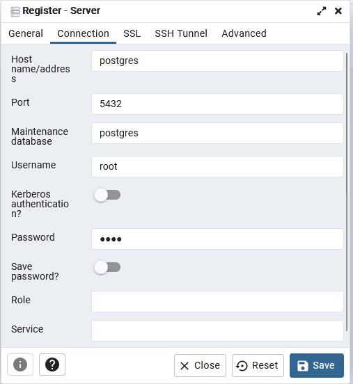

# Récupération du projet

```console
> git clone https://github.com/Eliwena/MotoChat-Examen.git
```

# Lancement du back

```console
> docker-compose build 
```

```console
> docker-compose up -d
```
---
# Base de donnée 

Se rendre à l'adresse suivante : http://localhost:16543

Entrer les informations de connection : 
- Email : placeholder@example.com
- Password : fakepassword123!

Clic droit sur 'Servers' → 'Register' → 'Server'

Dans la partie Général nommé le server : MotoChat

Dans la partie Connection compléter comme cela : 



Se rendre dans le fichier **server.js** ligne 28 et changer l'élement alter en force. **Pensez a bien sauvegarder !**

Relancer votre docker APP et faite la modification inverse : force en alter

---
# Lancement du front

```console
> cd client
```

```console
> npm install
```

```console
> npm run build
```

```console
> npm run serve
```

---
# Identifiant de connection 


|Qui | Username | MDP |
|:-:|:-:|:-:|
| User | User | user |
| Admin | Admin | admin |

